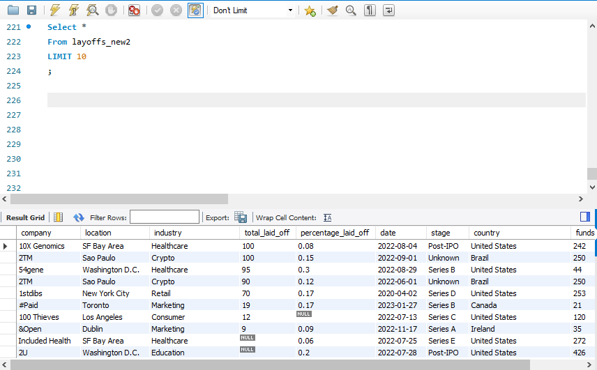

# 🛠️ Data Cleaning using MySQL

## 🔹 About the Project  
This project focuses on cleaning and standardizing a dataset of layoffs using MySQL.  
The dataset contained duplicate records, NULL values, and inconsistent formatting, which were addressed using SQL techniques.  

## 🛠️ Steps Performed:
1️⃣ **Removing Duplicates** using `ROW_NUMBER() OVER()`.  
2️⃣ **Standardizing Data** (trimming spaces, converting text to lowercase).  
3️⃣ **Handling NULL Values** (filling missing data where possible).  
4️⃣ **Changing Data Types** for consistency (e.g., converting `TEXT` to `DATE`). 

## 🖼️ Data Cleaning Process

### 🔴 Before Cleaning  
Here’s how the dataset looked before cleaning:  

### 🟢 After Cleaning  
Here’s how the dataset looks after cleaning:  

## 📂 Files Included:
- `Project.sql` → The SQL script used for cleaning.  
- `Sample_Data.csv` → Example of raw data before cleaning.  

 

---

### 🔗 Connect with me:  
📌 **LinkedIn:** [Your LinkedIn Profile](https://www.linkedin.com/in/serag-higazy-3ab4641b6/)  
📌 **Portfolio:** [Your Portfolio](https://higazyserag1.wixsite.com/portfolio) 

